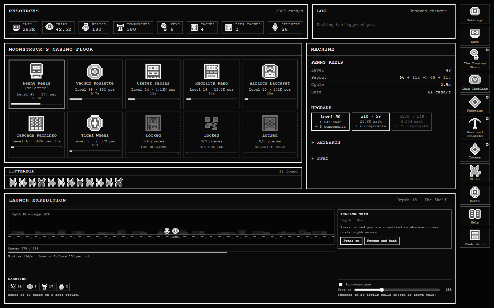
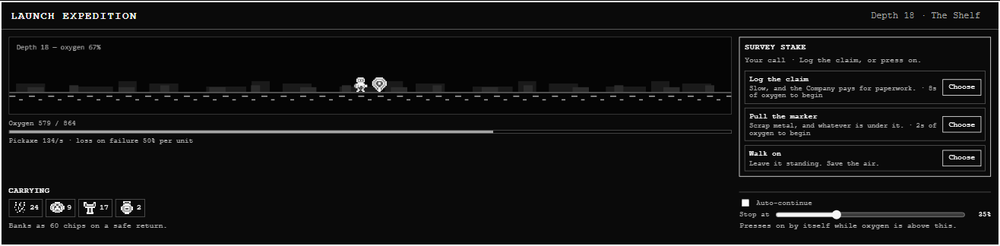
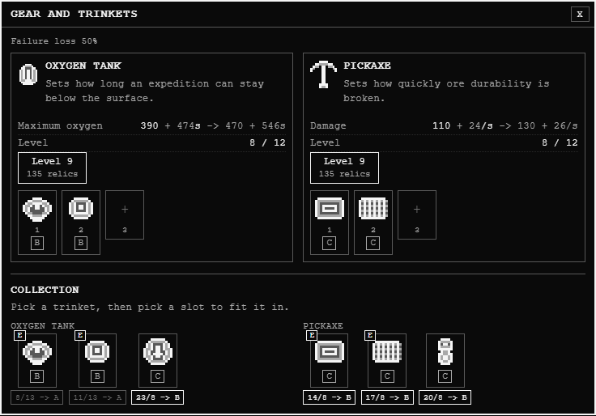
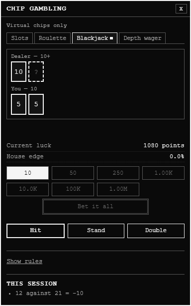
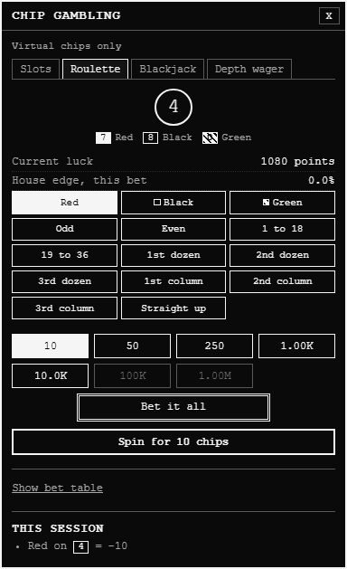
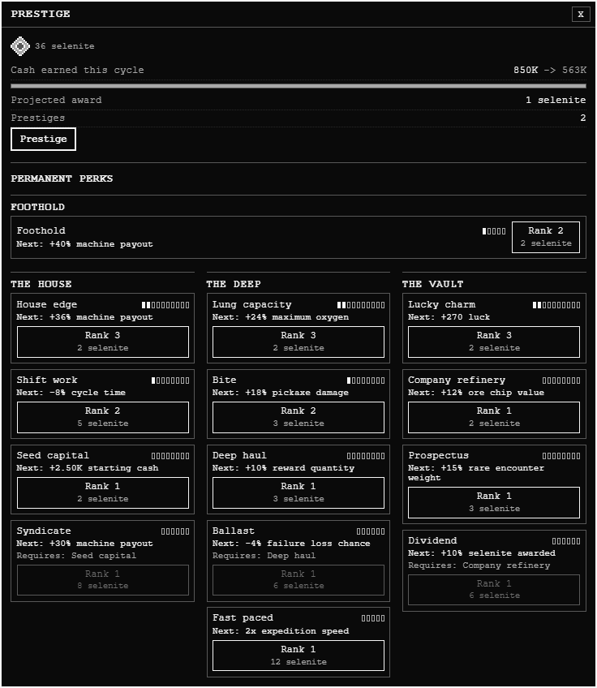

# Lunar Jackpot

**[🎰 Play Lunar Jackpot](https://YOUR-SITE.onrender.com)**

A web-based incremental casino game with roguelite elements!



*Build your casino. Brave the depths. The Company is counting on you.*

## Overview

You're an employee of The Company. Who isn't these days? Due to your pervasive gambling habits, they've requested (in terms not so soft) that you open a casino on the moon to extract the local residents of all of their extra cash. In exchange, they'll forgive your debts (for a while). What could go wrong? A lot, as it turns out. To keep the casino growing, you'll need to venture deep underground, bringing only an oxygen tank and your trusty Company© pickaxe. You'll need to hack through the thick lunar rock to find ore, machine parts, and who knows what else (meow). Good luck, have fun, don't die!

## Gameplay

### Casino
The casino acts as any other incremental game - buy a machine, the machine makes money. Upgrade the machine with said money! Buy a new machine - oh wait, you can't. The Company lost the plans. You might find them deep underground - but who knows what else you might find. The good news is that The Company has you on a gambling recovery program - you can't gamble with the casino profits, but they'll cash out any ore you find for Company Chips, which can be spent at their own casino! These chips can be used to upgrade machines even further, or unlock cosmetics! Not that it matters - the house always wins.

### Expeditions
Expeditions are the roguelite element - venture underground and bash through encounter after encounter, hoping to bring back more than you left with - maybe some pride! After each encounter, you'll need to decide whether you push on into the unknown, or return there and then. You'll need to upgrade your oxygen tank and pickaxe to increase the depth you can go - but that's not all! Introducing another Company sanctioned gambling adventure! Underground, you'll sometimes find caches, which can be opened using Company Keys. Caches might just give you a trinket or a totem - both are items that will help you on your journey through gambling recovery! Trinkets go on your gear, and totems are displayed proudly - both will affect all sorts of things. They're critical to your success. Don't forget them!



*Every encounter is a decision. Spend your oxygen wisely—and know when to bring the haul home.*

### Gear and Trinkets

A bigger tank buys more time. A better pickaxe breaks more rock. Fit the trinkets you find to your gear and build a loadout for the next descent.



### Luck
Luck is a fickle thing. That's how you got here to begin with. Some things might increase your luck, but don't be fooled. The Company always wins.

Take your Company Chips to the tables: slots, roulette, blackjack, and a wager on how deep your next expedition will go. Feeling lucky?

| Hit, stand, or double down | Pick a pocket and let it spin |
| --- | --- |
|  |  |

### Prestige
Had enough of this old joint? Start again! There's a perk tree and everything. Oh you want to leave? Unfortunately, The Company thinks *you've still got a problem.* Get back out there you!



*Start over with an advantage. Shape the next run through permanent casino, expedition, and luck upgrades.*

## Running Locally

Use Node.js 24 and npm 11 (the repository records npm 11.6.1). No API keys or backend services are needed.

```bash
npm ci
npm run dev
```

Open the local URL printed by Vite. To build and preview the production version:

```bash
npm run build
npm run preview
```

## Checks

```bash
npm run typecheck
npm test
npx playwright install chromium
npm run test:e2e
npm run test:e2e:production
npm audit
```

The browser suite starts its own server on port 4173; keep that port free. `test:e2e` uses the development server; `test:e2e:production` builds and tests the production site, and is used by GitHub CI. On Linux, use `npx playwright install --with-deps chromium` to install browser system dependencies as well.

## Saves and development tools

Progress is saved locally in your browser using IndexedDB. There is no account or cloud sync. Use the Save panel to export a backup before clearing browser data or changing browsers or site addresses. Game currencies are fictional; the game has no payments or cash withdrawals.

The production game includes a save editor opened with **Ctrl + Shift + Alt + D**. Its edits permanently mark the save as developer-edited - if you choose to dabble, The Company will know. Detailed diagnostics are available only in development builds.

## Project layout

- `src/content`: game definitions and balance data.
- `src/domain`: game rules and state transitions.
- `src/app`, `src/ui`, `src/rendering`, `src/audio`: runtime, interface, procedural visuals, and audio.
- `src/persistence`: save validation, migration, import/export, and browser storage.
- `src/tests`: unit, integration, and browser tests.

## Publishing

Commit the source and `package-lock.json`. Dependencies, build output, test reports, local tooling, environment files, and private development notes in `docs/` are ignored.

`npm run build` produces a static site in `dist/`. For a GitHub Pages project site, build with `npm run build -- --base=/YOUR-REPOSITORY/` and publish the resulting `dist/` directory. Publishing the repository alone does not deploy the game.

## Rights and permissions

**Proprietary software — all rights reserved.** No permission is granted to use, modify, redistribute, host, sell, or commercially exploit the original game or its accompanying materials without prior written permission from the applicable copyright holder. Source availability and setup instructions do not grant a license. See [the full notice](LICENSE).

Rights available under applicable law and hosting-platform terms are unaffected. A public GitHub repository permits viewing and forking through GitHub under its [Terms of Service](https://docs.github.com/en/site-policy/github-terms/github-terms-of-service#d-user-generated-content). Third-party dependencies retain their own licenses.
